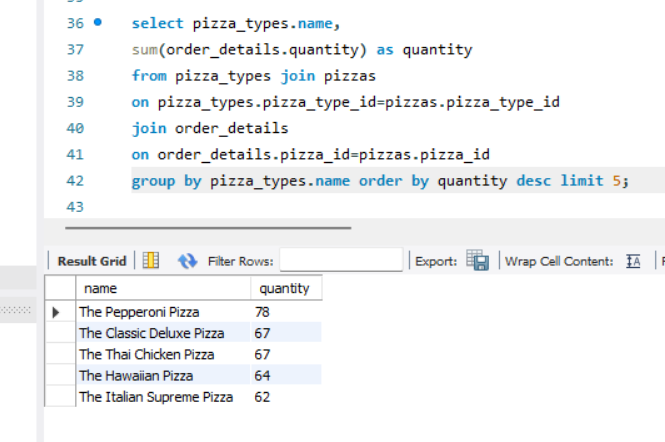

# 🍕 Pizza Sales Analysis using SQL

## 🔍 Project Overview

This project analyzes pizza sales data using **SQL** to uncover sales trends, customer preferences, and business performance insights. The analysis helps understand revenue drivers and supports data-driven decision-making for a food retail business.

---

## 🎯 Problem Statement

The objective of this project is to:

* Analyze overall sales performance and revenue trends
* Identify top-selling pizzas and categories
* Understand customer purchase behavior
* Extract actionable insights to improve sales and inventory planning

---

## 📁 Dataset Description

The dataset consists of multiple relational tables containing:

* Order details (order ID, date, time)
* Pizza details (pizza name, size, category)
* Sales information (quantity, price)

---

## 🛠️ Tools & Technologies Used

* **MySQL**
* **SQL Queries**
* **Relational Database Concepts**

---

## 🧩 Database Tables Used

* `orders`
* `order_details`
* `pizzas`
* `pizza_types`

---

## 📊 Key Analysis Performed

* Total revenue and total orders calculation
* Top-selling pizzas based on quantity and revenue
* Category-wise and size-wise sales analysis
* Daily and monthly sales trends
* Average order value calculation

---

## 🧠 SQL Concepts Used

* `SELECT`, `WHERE`, `ORDER BY`
* `GROUP BY`, `HAVING`
* Aggregate functions (`SUM`, `COUNT`, `AVG`)
* `JOIN` (INNER JOIN)
* Subqueries

---

## 💡 Key Insights

* Certain pizza categories generate significantly higher revenue
* Large-size pizzas contribute the most to total sales
* Peak sales occur during specific time periods and days
* A small set of pizzas contributes to a major portion of revenue

---

## 📌 Business Impact

* Helps identify best-selling and low-performing pizzas
* Supports inventory optimization and demand forecasting
* Assists management in pricing and promotional strategies

---

## ✅ Conclusion

This SQL-based analysis provides clear insights into sales performance and customer preferences. The results can help businesses optimize their menu, pricing strategies, and operational planning to maximize profitability.

---
## 📸 SQL Output Samples
The following screenshots show key SQL queries and their outputs used to analyze pizza sales performance.

## 📎 Project Type

**SQL Data Analysis | Data Analyst Portfolio Project**

